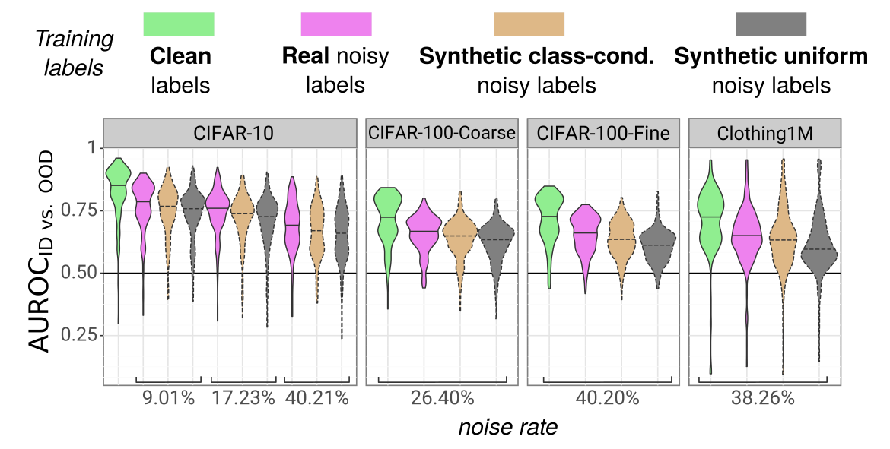
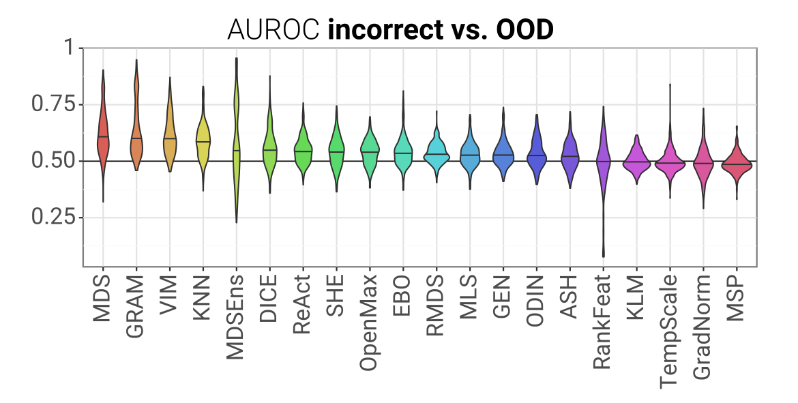
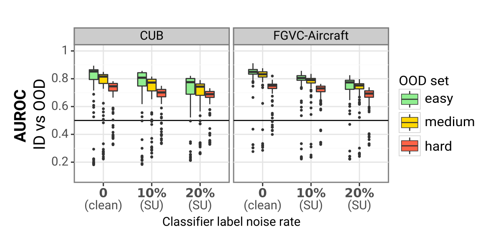

<h2 align="center">[CVPR'24] <a href="https://glhr.github.io/OOD-LabelNoise/">A noisy elephant in the room:<br> Is your out-of-distribution detector robust to label noise?</a></h2>

  <p align="center">
    <a href="https://arxiv.org/abs/2404.01775"></a> 
  </p>

<br>

*noisy vs. clean training labels?*             |  *ID mistakes vs. OOD images?* | *difficulty of the OOD set?*
:-------------------------:|:-------------------------:|:-------------------------:
  |    | 


## 🔎 About

Considering how pervasive the problem of label noise is in real-world image classification datasets, its effect on OOD detection is crucial to study.
To address this gap, we systematically analyse the label noise robustness of a wide range of OOD detectors. Specifically:
1. We present the first study of post-hoc OOD detection in the presence of noisy classification labels, examining the performance of 20 state-of-the-art methods under different types and levels of label noise in the training data. Our study includes multiple classification architectures and datasets, ranging from the beloved CIFAR10 to the more difficult Clothing1M, and shows that even at a low noise rate, the label noise setting poses an interesting challenge for many methods.
2. We revisit the notion that OOD detection performance correlates with ID accuracy, examining when and why this relation holds. Robustness to inaccurate classification requires that OOD detectors effectively separate mistakes on ID data from OOD samples - yet most existing methods confound the two.


## 👩🏻‍🏫 Getting started

### What's in this repo?

* the [analysis](analysis) folder contains the scripts used to process and analyse results.
  * The [analysis/paper_figures.ipynb](analysis/paper_figures.ipynb) notebook is a good place to start. It reproduces all the visualizations and results in the paper, supplementary material and poster.
* the [run](run) folder contains bash scripts to train the base classifiers on different sets of (clean or noisy) labels (e.g. [run/cifar10_train.sh](run/cifar10_train.sh)), and then evaluate post-hoc OOD detectors (e.g. [run/cifar10_eval.sh](run/cifar10_eval.sh)). Training checkpoints and OOD detection results are saved in the [results](results) folder.

The rest of the repo follows the structure of [OpenOOD](https://github.com/Jingkang50/OpenOOD):

* [data/images_classic](data/images_classic) contains the raw ID & OOD datasets and annotations. See [data/README.md](data/README.md) for download instructions.

* [data/benchmark_imglist](data/benchmark_imglist) contains the list of images and corresponding label for each train, val, test and OOD set. For example, the training labels for CIFAR-10N-Agg (9.01% noise rate) can be found in [data/benchmark_imglist/train_cifar10n_agg.txt](data/benchmark_imglist/train_cifar10n_agg.txt) . We provide all the .txt files used in our experiments, as well as the scripts used to generate them.

  * for the code used to generate the clean & real noisy label sets, see the dataset-specific notebooks in the [data/images_classic](data/images_classic) folder (.e.g  [create_txt_files_cifar10.ipynb](data/images_classic/CIFAR-N/create_txt_files_cifar10.ipynb), [create_txt_files_clothing1m.ipynb](data/images_classic/clothing1M/create_txt_files_clothing1m.ipynb), [create_txt_files_cub.ipynb](data/images_classic/CUB_200_2011/create_txt_files_cub.ipynb) ...)
  * synthetic label sets are generated from the [data/benchmark_imglist/generate_synth_labels.ipynb](data/benchmark_imglist/generate_synth_labels.ipynb) notebook. 

### Conda environments

This code was tested on Ubuntu 18.04 + CUDA 11.3 & Ubuntu 20.04 + CUDA 12.5 with Python 3.11.3 + PyTorch 2.0.1. CUDA & PyTorch are only necessary for training classifiers and evaluating OOD detectors yourself. If you are only interested in reproducing the paper's tables & visualizations, you can install a minimal environment.

#### Minimal environment

```shell
conda create --name ood-labelnoise-viz python=3.11.3
conda activate ood-labelnoise-viz
pip install -r requirements_viz.txt
```

#### Full environment

```shell
conda create -n ood-labelnoise python=3.11.3
conda activate ood-labelnoise
pip install torch==2.0.1+cu118 torchvision==0.15.2+cu118 -f https://download.pytorch.org/whl/torch_stable.html
conda install gcc_linux-64 gxx_linux-64
pip install Cython==3.0.2
pip install -r requirements_full.txt
```


## 📝 Updates
- June 13th 2024: Code repo released
- June 7th 2024: [Project page](https://glhr.github.io/OOD-LabelNoise/) released

## 📚 Citation

If you find our work useful, please cite:

```bibtex
@inproceedings{Humblot-Renaux_2024_CVPR,
  title={A noisy elephant in the room: Is your out-of-distribution detector robust to label noise?},
  author={Humblot-Renaux, Galadrielle and Escalera, Sergio and Moeslund, Thomas B.},
  booktitle={Proceedings of the IEEE/CVF Conference on Computer Vision and Pattern Recognition (CVPR)},
  year={2024},
}
```

## ✉️ Contact

If you have have any issues or doubts about the code, please create a Github issue. Otherwise, you can contact me at gegeh@create.aau.dk

## 🤝🏼 Acknowledgements
- Our codebase heavily builds on the [OpenOOD benchmark](https://github.com/Jingkang50/OpenOOD). We list our main changes in the paper's [supplementary material](https://arxiv.org/src/2404.01775v1/anc/supplementary.pdf). 
- Our benchmark includes the [CIFAR-N](https://github.com/UCSC-REAL/cifar-10-100n) and [Clothing1M](https://github.com/Cysu/noisy_label) datasets. These are highly valuable as they provide pairs of clean vs. real noisy labels. 
- We use the [deep-significance](https://github.com/Kaleidophon/deep-significance) implementation of the Almost Stochastic Order test in our experimental comparisons.
- We follow the training procedure and splits from the [Semantic Shift Benchmark](https://github.com/sgvaze/SSB) to evaluate fine-grained semantic shift detection.
- The Compact Transformer and MLPMixer model implementation and training hyper-parameters are based on the following repositories: [Compact-Transformers](https://github.com/SHI-Labs/Compact-Transformers) and [vision-transformers-cifar10](https://github.com/kentaroy47/vision-transformers-cifar10).
